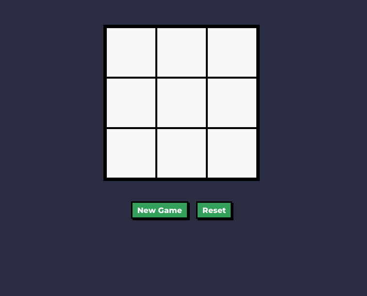
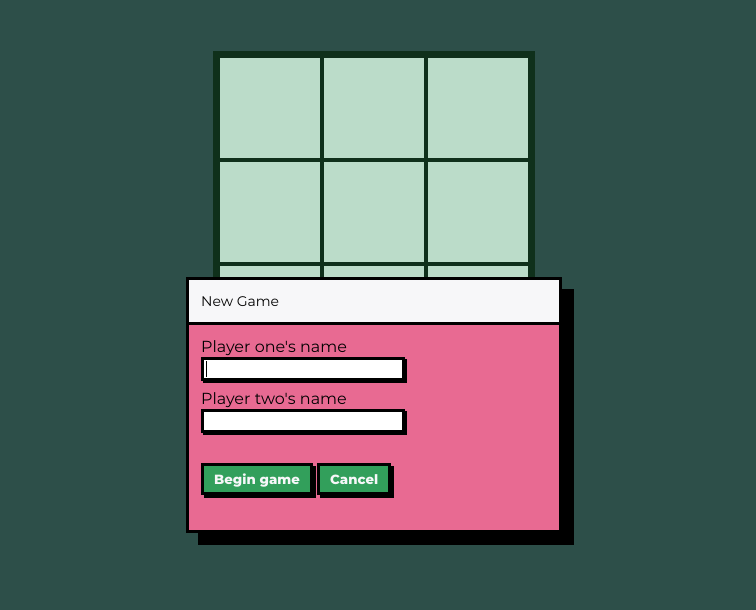

# odin-tic-tac-toe
Just another tic tac toe game app. Part of The Odin Project curriculum

## Overview

In this project I explored the use of javascript factory functions and the module pattern. Essentially putting all the logic behind functions making the variables private and not accessible except what the logic inside those functions allow for. It's a good introduction to using modules which from the little I know from React will be very useful when learning more about this framework. 

It took me more time than I was expecting but mostly because I had to research and go back a lesson to better understand the concepts used. In the end I feel I was able to understand the concepts and see their potential and importance.

## Features

- Two player game
- Ability to create a new game and reset current one

## Demo

🔗 [Live Demo](https://joaocc1.github.io/odin-tic-tac-toe/)

### Screenshots

*Initial view when entering page*

*Popup to input player names when clicking new game button*
